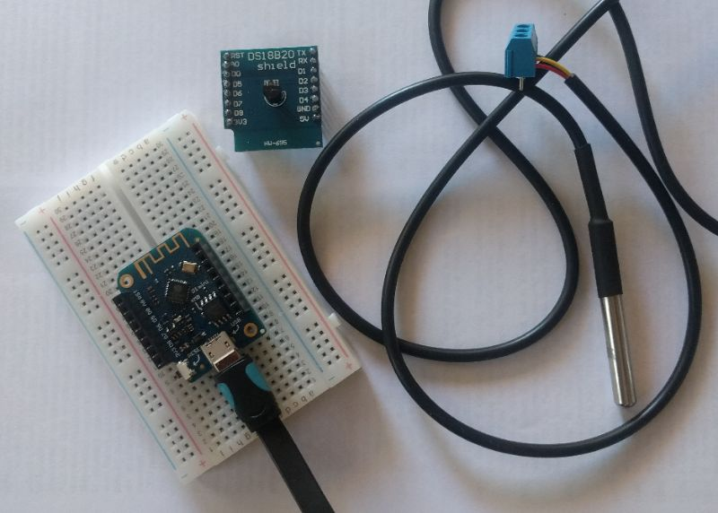

# micropython_ds18x20

this is a really basic tutorial for using the Dallas DS18b20 temperature sensor  
on the esp8266 port of micropython

 i used the [lolin esp8266  D1 mini pro board](https://wiki.wemos.cc/products:d1:d1_mini_pro) and a [cheap ds18b20 breakout shield](https://www.aliexpress.com/item/DS18B20-Temperature-Sensor-Shield-For-Wemos-D1-Mini-Wemos-D1-Mini-Wifi-Extension-Board-Compatible-For/32806569797.html?spm=a2g0s.9042311.0.0.11e14c4dIqQPyq) 
. 

the ds18b20 sensors are often sold in a waterproof sealed unit with just the wires exposed.  You will need to pull up the data line (normally yellow) to VCC with a 4.7kOhm resistor. I am not covering this aspect in this tutorial but this is explained well [elsewhere](https://diyprojects.io/temperature-measurement-ds18b20-arduino-code-compatible-esp8266-esp32-publication-domoticz-http/)

--- 

- OneWire and ds18x20 micropython library modules are both in the standard [esp8266 port of micropython](https://micropython.org/download#esp8266) so it is really easy to get started.

- The data line on this particular shield is connected to D2 on the Wemos (GPIO 4)
- each ds18b20 has a 64bit address fixed at manufacture which you access by the scan function 
- you need this address to run the convert_temp function 
- then you can run read_temp function which returns temp in Celcius


```
dat = machine.Pin(4) 
ds = ds18x20.DS18X20(onewire.OneWire(dat))
roms = ds.scan() #this should return a single entry in a byte array
while True:
    ds.convert_temp()
    time.sleep_ms(750) #temp conversion takes 750ms from datasheet
    temp = ds.read_temp(roms[0])
    print(temp)
    time.sleep(5)
```

